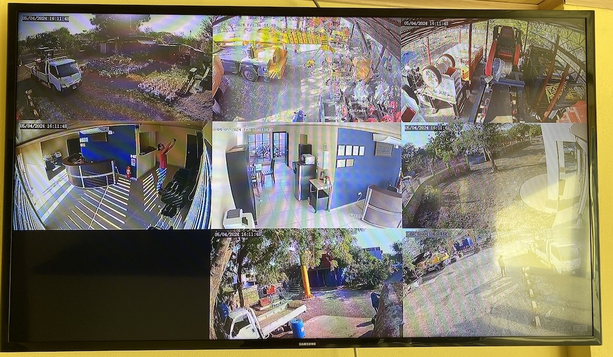

# Moved to Github

This repository was moved to Github. My original repository has >4 years of activity from 2020-09-28 to 2024-11-18:

https://bitbucket.org/marcosjom/thinstream-src/

# sys-thinstream-src

# What is it?

This is a Real-Time-Stream-Protocol (RTSP) based cameras recorder and distribution system.

Compile and install this in a RaspberryPi or any server of your choice in your cameras' local network, it will:

- stablish RTSP (TCP) RTP/RTPC (UDP) communications with your cameras.
- optionally, will record your streams on disk, deleting old files after a treshhold.
- optionally, will serve your real-time and recorded streams via HTTP/S server for remote viewing.

If you pair this service with nbplayer, you can stream to one or multiple TVs or monitors to render grids of your cameras.

# ToDo:

Add compilation and install instructions.
